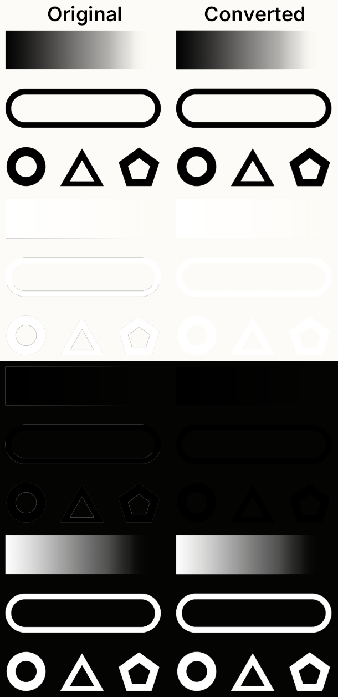

# PNG Alpha Premultiplication Tool

A simple utility to apply alpha premultiplication to PNG files.

## Why?

When scaling images, ImGui (used by CSP) applies linear filtering, which blends neighboring pixels.  
If a PNG has semi transparent edges this can cause visible outlines, especially when the image is drawn smaller or larger than its original size.

Heres is a example of a 4000×4000 test image drawn at 300×300:  


The full size test images and a demo app to try it ingame are included.  
To use the app, move the `pre-mult-test` folder to your `/assettocorsa/apps/lua` directory and open it ingame.

## Usage

Download the repository [here](https://github.com/C1XTZ/png-premult-gui/archive/refs/heads/main.zip) and unzip it.

Inside the `png-premult-gui` folder, you have two ways to run it:

- **Prebuilt Executable:** Launch `png-premult-gui.exe`
  - Requires trusting a random unsigned `.exe` from the internet.
- **Python Script:** Run `png-premult-gui.pyw`
  - Requires Python and the Pillow library; install via `pip install pillow`

> [!IMPORTANT]
> I recommend using the `png-premult-gui.pyw` if possible or compiling the executable yourself.  
> To build the executable, run `build-exe.bat`  
> Requires Python and the Pillow and PyInstaller libraries; install via `pip install pillow pyinstaller`

In your lua code, simply wrap your image drawing with `ui.beginPremultipliedAlphaTexture()` and `ui.endPremultipliedAlphaTexture()` when using the converted image:

```lua
ui.beginPremultipliedAlphaTexture()
ui.image(imgSource, imgSize)
ui.endPremultipliedAlphaTexture()
```

# License

This repository is under the [MIT](https://opensource.org/licenses/MIT) license. What does this mean?

### What you can do:

- Modify the code
- Use the code privately and commercially
- Distribute the code (including in other projects)
- License your modifications however you like

### What you are required to do:

- Include the original copyright
- Include the license text in any copies or substantial portions of the code

### What you don't get:

- Liability
- Warranty

This is a very permissive license. You can basically do whatever you want with the code, just make sure the original license and attribution stay intact.

Full license details are available in the [`LICENSE`](./LICENSE) file or on [https://opensource.org/licenses/MIT](https://opensource.org/licenses/MIT)

## Exception

The [`icon.ico`](./png-premult-gui/icon.ico) by Icons8 from [icon-icons.com](https://icon-icons.com/icon/png/2742) is licensed under the [CC BY 4.0](https://creativecommons.org/licenses/by/4.0/) license.
It was modified to be white.
