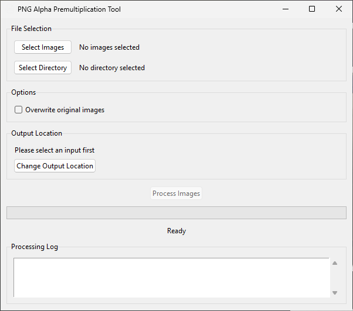

# PNG Alpha Premultiplication Tool

A simple utility to apply alpha premultiplication to PNG files.



## Why?

When scaling images, ImGui (used by CSP) applies linear filtering, which blends neighboring pixels.  
If a PNG has semi transparent edges this can cause visible outlines.

Here is a example of a 4000×4000 test image drawn at 300×300:  


The full size test images and a demo app to try it ingame are included in the `png-premult-gui.zip`.  
To use the app, move the `pre-mult-test` folder to your `/assettocorsa/apps/lua` directory and open it ingame.

## Usage

Downloads are available from the releases [here](https://github.com/C1XTZ/png-premult-gui/releases/latest)

### Prebuilt Executable

- **Download and Launch `png-premult-gui.exe`**
  - Ready to use immediately but requires trusting an unsigned executable.
  - Windows Defender might flag and quarantine it.

> [!IMPORTANT]  
> The following steps require you to have **Python 3.12.x** installed. [Download Python](https://www.python.org/downloads/)  
> Building your own executable requires a compiler. [Read more](https://nuitka.net/user-documentation/user-manual.html#c-compiler)

### Isolated Python Environment

- Download `png-premult-gui.zip` and extract it.
- Open the `png-premult-gui` folder.
- Run `setup-venv.bat` to create a Python environment.
  - After the setup, you can run `png-premult-gui.pyw` or build an executable with `build-exe.bat`

### System-wide Installation

- Download `png-premult-gui.zip` and extract it.
- Open the `png-premult-gui` folder and either:
- Run `png-premult-gui.pyw`
  - Install required packages with `pip install numpy pillow` if needed.
- or build an executable with `build-exe.bat`
  - Install required packages with `pip install numpy pillow nuitka` if needed.

### Using the images in lua

In your lua code, simply wrap your image drawing with `ui.beginPremultipliedAlphaTexture()` and `ui.endPremultipliedAlphaTexture()` when using the converted image:

```lua
ui.beginPremultipliedAlphaTexture()
ui.image(imgSource, imgSize)
ui.endPremultipliedAlphaTexture()
```

# License

This repository is under the [MIT](https://opensource.org/licenses/MIT) license. What does this mean?

### What you can do:

- Modify the code
- Use the code privately and commercially
- Distribute the code (including in other projects)
- License your modifications however you like

### What you are required to do:

- Include the original copyright
- Include the license text in any copies or substantial portions of the code

### What you don't get:

- Liability
- Warranty

This is a very permissive license. You can basically do whatever you want with the code, just make sure the original license and attribution stay intact.

Full license details are available in the [`LICENSE`](./LICENSE) file or on [https://opensource.org/licenses/MIT](https://opensource.org/licenses/MIT)

## Exception

The [`icon.ico`](./png-premult-gui/icon.ico) by Icons8 from [icon-icons.com](https://icon-icons.com/icon/png/2742) is licensed under the [CC BY 4.0](https://creativecommons.org/licenses/by/4.0/) license.
It was modified to be white.
